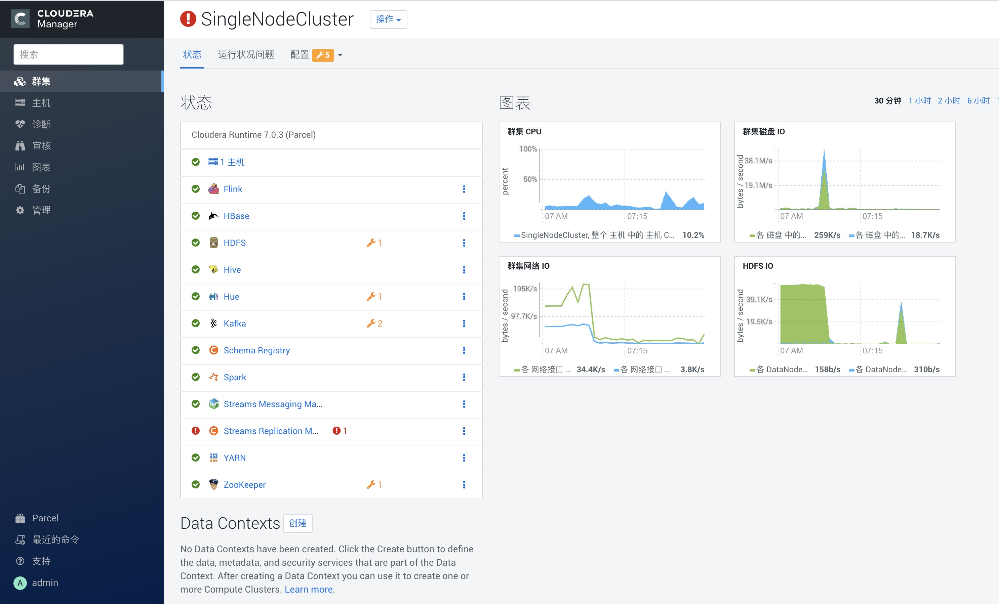

## StreamProcessingDemo

Kafka is a distributed, partitioned, replicated commit log service. It provides the functionality of a messaging system, but with a unique design. 

Kafka is used widely for stream processing and Kafka is really a good tools for stream processing. But Customers who use Kafka today struggle with monitoring / “seeing”/troubleshooting what is happening in their clusters.**Streams Messageing Manager(SMM)** cure Kafka blindness and help the  different streaming personas be more productive and provides an End-to-end integration with Ambari/Cloudera Manager, Grafana, Ranger & Atlas.

Kafka is a stream processing system, it also nees high availability and disaster recovery,but the legacy MirrorMaker has a lot of challenge/limitation, make it not easy to satisfy enterprise use.**Streams Replication Manager(SRM)** supports active-active, multi-cluster, cross DC replication & other complex scenarios and HA. it also integrates replication monitoring with SMM.


Because Kafka is used widely, we only show a simple Kafka producer and consumer and focus on SMM.
Because SMM and SRM is integrated in Cloudera Manager,we use the Cloudera Data Platform to do this workshop.



Check the Kafka and Streams Messaging Manager status is normal(Green)

# Accessing your Cluster
Credentials will be provided for these services by the instructor:
- SSH
- Cloudera Manager

# Use your Cluster
you can download the [StreamProcessingDemo](https://github.com/wangxf2000/StreamProcessingDemo.git) github https://github.com/wangxf2000/StreamProcessingDemo.git first(using **download zip** or **git clone https://github.com/wangxf2000/StreamProcessingDemo.git**), then you can use the **ppk** or **pem** file from the github for the next steps.

## To connect using Putty from Windows laptop
NOTE: The following instructions are for using [Putty](https://www.chiark.greenend.org.uk/~sgtatham/putty/latest.html). You can also use other popular SSH tools such as [MobaXterm](https://mobaxterm.mobatek.net/) or [SmarTTY](https://sysprogs.com/SmarTTY/)

- Right click to download this [ppk key](cdf_workshop.ppk) > Save link as > save to Downloads folder
- Use putty to connect to your node using the ppk key:
  - Connection > SSH > Auth > Private key for authentication > Browse... > Select cdf-workshop.ppk


- Create a new seession called cdf-workshop
  - For the Host Name use: ec2-user@IP_ADDRESS_OF_EC2_NODE
  - Click "Save" on the session page before logging in


- if you have any problem to use putty access Node, access this user guide [使用PuTTY从Windows连接到Linux实例](https://docs.aws.amazon.com/zh_cn/AWSEC2/latest/UserGuide/putty.html)

## To connect from Linux/MacOSX laptop
SSH into your EC2 node using below steps:
- Right click to download this [pem key](cdf_workshop.pem) > Save link as > save to Downloads folder
- Copy pem key to ~/.ssh dir and correct permissions
```
cp ~/Downloads/cdf_workshop.pem ~/.ssh/
chmod 400 ~/.ssh/cdf_workshop.pem
```
- Login to the ec2 node of the you have been assigned by replacing IP_ADDRESS_OF_EC2_NODE below with EC2 node IP Address (your instructor will provide this)
```
 ssh -i  ~/.ssh/cdf_workshop.pem ec2-user@IP_ADDRESS_OF_EC2_NODE
 ```
 - To change user to root you can:
 ```
 sudo su -
 ```
 
 ## Login to Cloudera Manager
- Login to Cloudera Manager web UI by opening http://{YOUR_IP}:7180 and log in with **admin/admin**,you can get the YOUR_IP from the instructor.
- You will see a list of Hadoop components running on your node on the left side of the page

- They should all show green (ie started) status. If not, start them by Cloudera Manager via 'restart service' menu for that service
 

# Prepare the demo
### Using PuTTy or teminal to Login the server.Using the following script to prepare the env.
```
# install maven and set maven environment variables
wget https://mirrors.tuna.tsinghua.edu.cn/apache/maven/maven-3/3.6.3/binaries/apache-maven-3.6.3-bin.tar.gz
tar -zxvf apache-maven-3.6.3-bin.tar.gz
cd apache-maven-3.6.3 

cat <<EOF >>/etc/profile
export MAVEN_HOME=/root/apache-maven-3.6.3
export PATH=\$PATH:\$MAVEN_HOME/bin
EOF

source /etc/profile

## download the demo script
cd ~
git clone https://github.com/wangxf2000/StreamProcessingDemo.git
cd StreamProcessingDemo
sed -i "s/localhost/`hostname -A | sed s/[[:space:]]//g`/g" src/main/resources/application.properties

mvn package
```
if successful, that works. else check your environment.


# Kafka Demo 
### 1. The kafka services is running on the background. we create a topic with a single partition:
```
/opt/cloudera/parcels/CDH/bin/kafka-topics --create --bootstrap-server `hostname -i`:9092 --replication-factor 1 --partitions 1 --topic console-test
```

### 2.Check the topic we just created:
```
/opt/cloudera/parcels/CDH/bin/kafka-topics  --list --bootstrap-server `hostname -i`:9092
```

### 3.produce message
```
/opt/cloudera/parcels/CDH/bin/kafka-console-producer --broker-list `hostname -i`:9092 --topic console-test
```
then you can create some messages in console, like 
```
--send message in console
this is a message
this is another message
```

### 4.consume message
open another console
```
/opt/cloudera/parcels/CDH/bin/kafka-console-consumer --bootstrap-server `hostname -i`:9092 --topic console-test  --from-beginning
```
then you can see the messages you created in step 3.

# SMM Demo
### 1. Check the topic from SMM:
access SMM from SMM UI

or from the link http://{YOUR_IP}:9991/ ***please using the public IP to replace internal IP.***
you can find some-topic topic in SMM Overview.


### 2. Run the Demo with one producer and one consumer
```
$ java -jar target/kafka-demo-0.0.1-SNAPSHOT.jar
```
back to SMM Overview and check the some-topic topic's data in and data out.if the data in is zero, refresh it.

click the some-topic topic,you can see some detail info.

We can view detailed info through the data profile!(data_profile_icon.jpg)

Different metrics of the topic can be seen in the data profile. you can see the data in count/data out count/message count.
When you click the data explore,you can see the partition/offset and detail message.


when you click the configs,you can see and modify the topic configuration with UI.

if you need modify the advance config of the topic, you can click the advanced to modify it.

SMM doesn't allow to modify some attributes like partition, you can use the command to modify it.
```
/opt/cloudera/parcels/CDH/bin/kafka-topics --alter --bootstrap-server `hostname`:9092 --partitions 3 --topic some-topic
```
then you can check the result in SMM configs.


if some consumer consume the message,you can see the latency of the topic.
you can try other functions, like alert policy and create topic.
### Alert
you can define the notifier and alert policy to notify alert.
- add notifier 
  - alert menu -> Notifiers -> Add New
  
  - define the notifier info, you can get the detail notifier property from [Creating a Notifier](https://docs.cloudera.com/csp/2.0.1/managing-alert-policies/topics/smm-creating-alert-notificaton.html)
  - you can add several notifiers,like 
   
- add Alert Policies
  - alert menu -> Alert Policies -> Add New
    
  - define the alert policy info, you can get the detail alert policy property from [Creating an Alert Policy](https://docs.cloudera.com/csp/2.0.1/managing-alert-policies/topics/smm-creating-alert-policy.html)
  - when you add the alert policies, the alert policies list looks like
    
- Alert History
  - when triggered the alert, you can see the info in alert history and notifier.
   
  - you can see the detail in see more.
   
  - you also can see the alert in kafak roles, like topic.
   
  - you can see the alert in the notifier,looks like:
   


