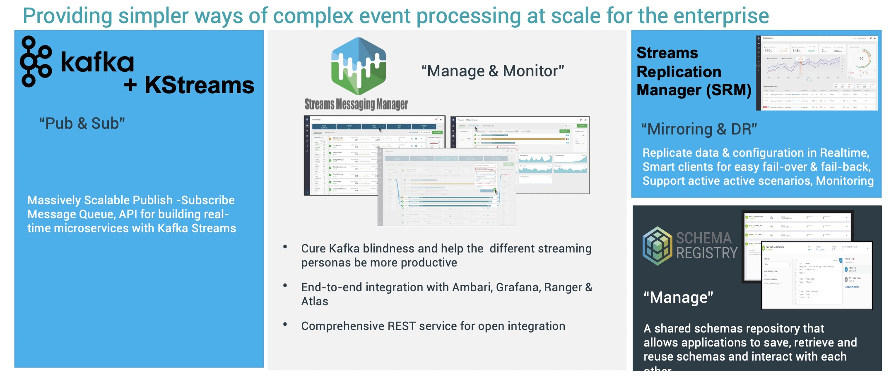
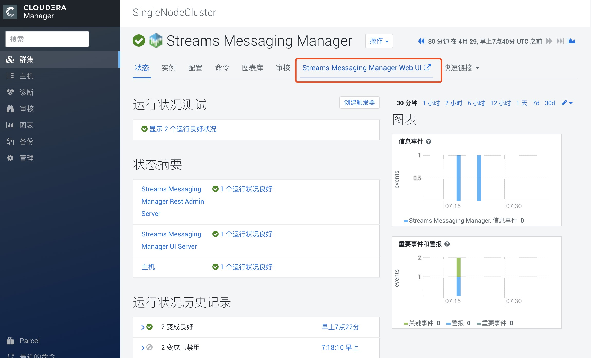
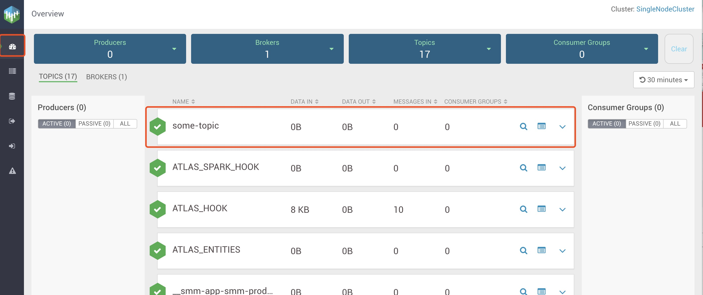
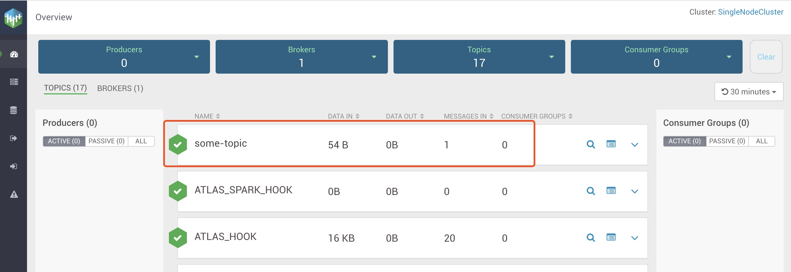

## StreamProcessingDemo

Kafka is a distributed, partitioned, replicated commit log service. It provides the functionality of a messaging system, but with a unique design. 

Kafka is used widely for stream processing and Kafka is really a good tools for stream processing. But Customers who use Kafka today struggle with monitoring / “seeing”/troubleshooting what is happening in their clusters.**Streams Messageing Manager(SMM)** cure Kafka blindness and help the  different streaming personas be more productive and provides an End-to-end integration with Ambari/Cloudera Manager, Grafana, Ranger & Atlas.

Kafka is a stream processing system, it also nees high availability and disaster recovery,but the legacy MirrorMaker has a lot of challenge/limitation, make it not easy to satisfy enterprise use.**Streams Replication Manager(SRM)** supports active-active, multi-cluster, cross DC replication & other complex scenarios and HA. it also integrates replication monitoring with SMM.




Because Kafka is used widely, we only show a simple Kafka producer and consumer and focus on SMM.
Because SMM and SRM is integrated in Cloudera Manager,we use the Cloudera Data Platform to do this workshop.


Check the Kafka and Streams Messaging Manager status is normal(Green)

# Prepare the demo
### Using the following script to prepare the env.
```
# install maven and set maven environment variables
wget https://mirrors.tuna.tsinghua.edu.cn/apache/maven/maven-3/3.6.3/binaries/apache-maven-3.6.3-bin.tar.gz
tar -zxvf apache-maven-3.6.3-bin.tar.gz
cd apache-maven-3.6.3 

cat <<EOF >>/etc/profile
export MAVEN_HOME=/root/apache-maven-3.6.3
export PATH=\$PATH:\$MAVEN_HOME/bin
EOF

source /etc/profile

## download the demo script
cd ..
git clone https://github.com/wangxf2000/StreamProcessingDemo.git
cd StreamProcessingDemo
sed -i "s/localhost/`hostname -A`/g" /root/StreamProcessingDemo/src/main/resources/application.properties

mvn package
```
if successful, that works. else check your environment.


# Running this 
### 1. The kafka services is running on the background. we create a topic with a single partition:
```
/opt/cloudera/parcels/CDH/bin/kafka-topics --create --bootstrap-server `hostname`:9092 --replication-factor 1 --partitions 1 --topic some-topic
```

### 2.Check the topic we just created:
```
/opt/cloudera/parcels/CDH/bin/kafka-topics  --list --bootstrap-server `hostname`:9092
```

### 3. Check the topic from SMM:
access SMM from SMM UI

or from the link http://grocery.vpc.cloudera.com:9991/ ***[grocery.vpc.cloudera.com need to be replaced]***
you can find some-topic topic in SMM Overview.


### 4. Run the Demo with one producer and one consumer
```
$ java -jar target/kafka-demo-0.0.1-SNAPSHOT.jar
```
back to SMM Overview and check the some-topic topic's data in and data out.if the data in is zero, refresh it.

click the some-topic topic,you can see some detail info.


